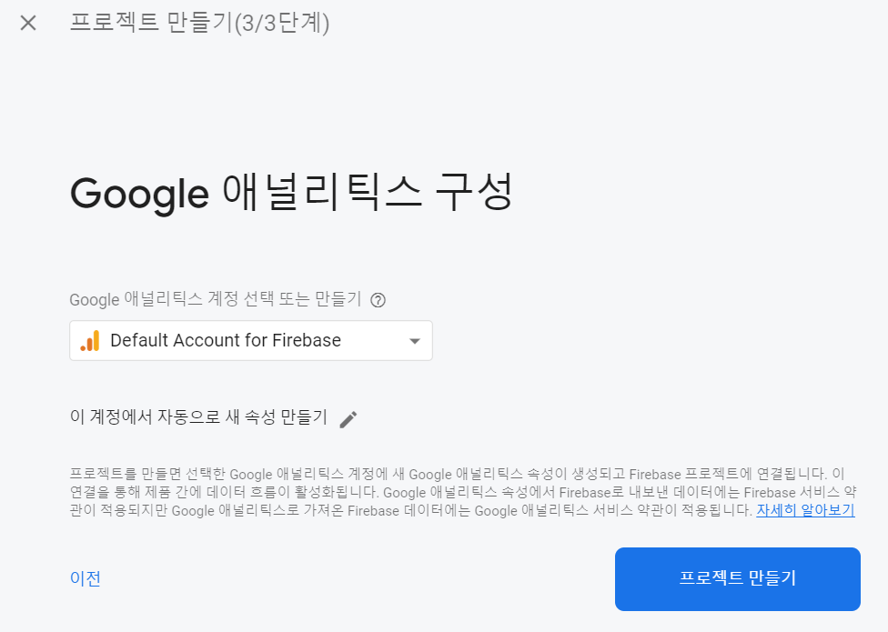
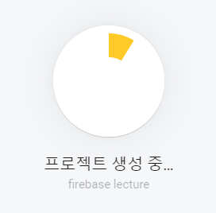

# 파이어베이스 뷰어 소개 및 초기화 방법 튜토리얼

## 소개

한국산업기술대학교 파이어베이스 특강에서 보조자료로 쓰이는 이 앱은 자신이 생성한 파이어베이스 db 구조를 실시간으로 볼 수 있는 앱입니다.

개인별 파이어베이스 인증 때문에 apk 파일은 제공되지 않고 git을 사용하여 소스 코드를 복제한 뒤 스스로 파이어베이스 인증 키를 발급받아서 컴파일해야 합니다.

## 설치법

### 파이어베이스 프로젝트 초기화

https://console.firebase.google.com/ 로 이동합니다. 로그인을 합니다.

새 프로젝트를 생성합니다.

프로젝트 이름을 자유롭게 정합니다.

구글 애널리틱스는 상관 없습니다.

프로젝트 생성이 완료될 때까지 기다립니다.

계속 버튼을 눌러서 진행합니다.

좌측 패널의 Database를 클릭합니다.

Realtime Database를 생성합니다. Firestore를 고르면 안됩니다!

테스트 모드를 선택합니다. 잠금 모드로 고르면 뷰어가 제대로 작동되지 않습니다.

사용 설정을 클릭합니다.

초기 상태의 db가 있습니다. 뭐라도 생성해 봅시다.

값을 정할수도 있고, 그렇지 않다면 자식 요소들을 생성해서 폴더처럼 사용할 수 있습니다.

데이터를 좀 넣어줬으니, 뷰어를 컴파일해서 확인해볼까요?

### api 인증 키 발급

콘솔 메인으로 갑니다. 안드로이드 로고를 클릭해줍시다.

설정된 안드로이드 패키지 이름을 씁니다. 기본값은 xyz.dps0340.firebase_visualizer 입니다.

앱 닉네임은 자유롭게 써주고, SHA-1은 상관 없습니다.

google-services.json을 받습니다. 인증 키로 쓰입니다.

3번은 눌러서 넘어가고 4번은 스킵해주세요.

안드로이드 스튜디오에서 코드를 열고 프로젝트 탭으로 갑니다.

올바른 경로는 app/google-services.json 입니다. 드래그 앤 드랍 해줍시다.

이렇게 인증 키 설정이 끝났습니다.

### 안드로이드 개발자 모드 허용

설정 앱을 엽니다.

맨 밑으로 간 뒤, 개발자 옵션이 보이지 않으므로 휴대전화 정보를 클릭합니다.

소프트웨어 정보를 클릭합니다.

빌드번호를 계속 클릭하면 개발자 모드가 켜집니다.

### USB 디버깅 허용

다시 설정으로 돌아가서 개발자 옵션으로 이동합니다.

USB 디버깅을 허용합니다. 그리고 컴퓨터와 스마트폰을 연결합니다.

이런 팝업창이 뜹니다. 이 컴퓨터에서 항상 허용->허용 순서로 진행해줍시다.

### 빌드

안드로이드 스튜디오를 켜고 코드를 엽니다. 프로젝트 탭을 눌러서 안드로이드 탭으로 전환합니다.

컴퓨터와 스마트폰을 연결한 채로 Run->Select Device를 클릭합니다.

자신의 스마트폰을 클릭해줍시다.

아무 Activity.kt나 열고 Run을 누릅니다.

빌드가 끝나면 스마트폰에 앱이 설치됩니다.

### 컴파일이 되지 않아요!

app/google-services.json에 제대로 된 파일을 넣지 않으면 컴파일이 되지 않습니다. 다시 확인해 주세요.

## 사용법

Firebase DB 조회를 클릭합니다.

제목이 있는 탭을 열면 자식 요소들이 나옵니다. 다시 누르면 닫을 수 있습니다.

DB에 업데이트가 이루어질때마다 실시간으로 갱신됩니다. 뷰어 자체에 수정 기능이나 생성 기능은 없습니다.
